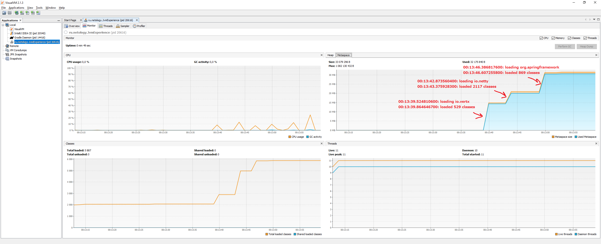
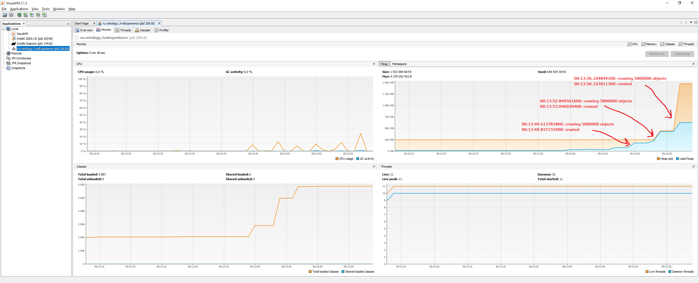

# Исследование JVM через VisualVM
---
## Код

Был запущен слудующий код

```java
public class JvmExperience {
    public static void main(String[] args) throws InterruptedException {
        System.out.println("Please open 'ru.netology.JvmExperience' in VisualVm");
        Thread.sleep(30_000);

        loadToMetaspaceAllFrom("io.vertx");
        Thread.sleep(3_000);
        loadToMetaspaceAllFrom("io.netty");
        Thread.sleep(3_000);
        loadToMetaspaceAllFrom("org.springframework");
        Thread.sleep(3_000);

        System.out.println(LocalTime.now() + ": now see heap");
        List<SimpleObject> simpleObjects = createSimpleObjects(5_000_000);
        Thread.sleep(3_000);
        simpleObjects.addAll(createSimpleObjects(5_000_000));
        Thread.sleep(3_000);
        simpleObjects.addAll(createSimpleObjects(5_000_000));
        Thread.sleep(3_000);
    }

    static void loadToMetaspaceAllFrom(String packageName) {
        System.out.println(LocalTime.now() + ": loading " + packageName);

        Reflections reflections = new Reflections(packageName, new SubTypesScanner(false));
        Set<Class<?>> allClasses = reflections.getSubTypesOf(Object.class);

        System.out.println(LocalTime.now() + ": loaded " + allClasses.size() + " classes");
    }

    private static List<SimpleObject> createSimpleObjects(int count) {
        System.out.println(LocalTime.now() + ": creating " + count + " objects");

        List<SimpleObject> result = new ArrayList<>(count);
        for (int i = 0; i < count; i++) {
            result.add(new SimpleObject(i));
        }

        System.out.println(LocalTime.now() + ": created");
        return result;
    }

    static class SimpleObject {
        final Integer value;
        SimpleObject(int value) {
            this.value = value;
        }
    }
}
```
## Вывод в консоль

- Please open 'ru.netology.JvmExperience' in VisualVm
- 00:13:39.524810600: loading io.vertx
- 00:13:39.864646700: loaded 529 classes
- 00:13:42.873560400: loading io.netty
- 00:13:43.375928300: loaded 2117 classes
- 00:13:46.386817600: loading org.springframework
- 00:13:46.607255800: loaded 869 classes
- 00:13:49.610788600: now see heap
- 00:13:49.613781800: creating 5000000 objects
- 00:13:49.837155400: created
- 00:13:52.849561600: creating 5000000 objects
- 00:13:53.046030400: created
- 00:13:56.104849100: creating 5000000 objects
- 00:13:56.323011300: created

## Скришоты VisualVM



На первом скриншоте видно заполнение метаспейса путем добавления классов последовательно из трех библиотек. С каждым разом расширялось используемое и соответственно выделяемое место метаспейса



На втором скриншоте видно заполнение хипа объектами также в три итерации. Здесь после первой итерации выделенный объем памяти на хип (250 Мбайт) не был превышен используемой. После второй итерации выделенная и используямая память была увеличена. После третьей память была выделана в гораздо большем объеме по сравнению с предыдущей итерацией.